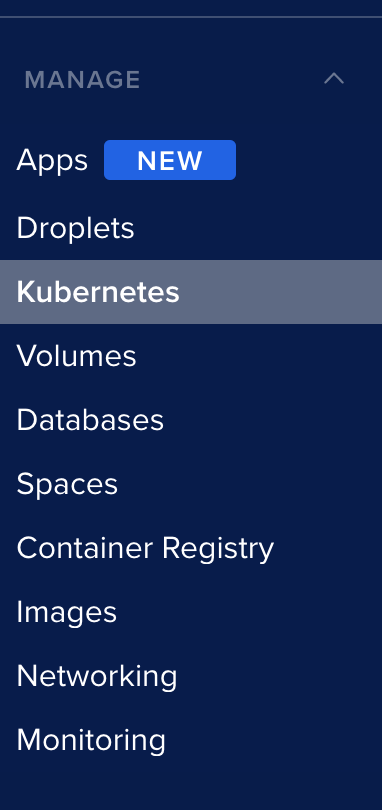
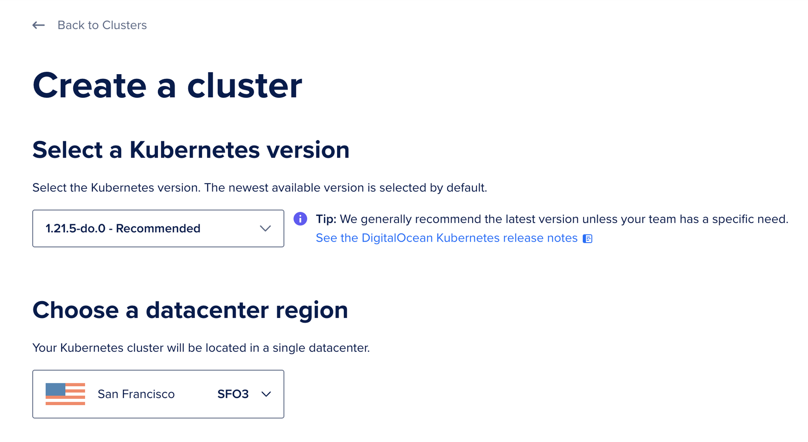
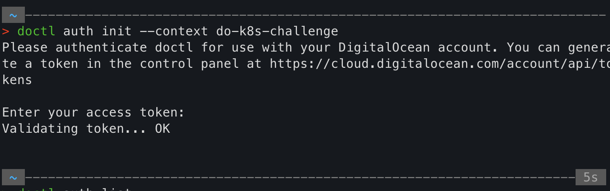
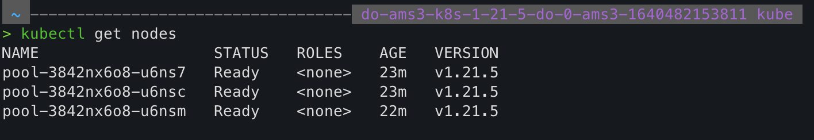
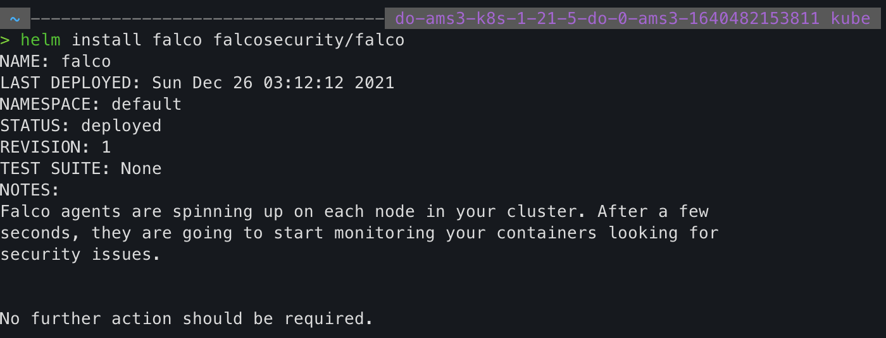
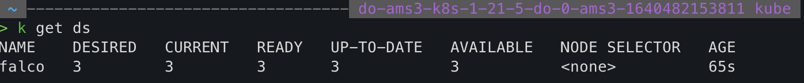
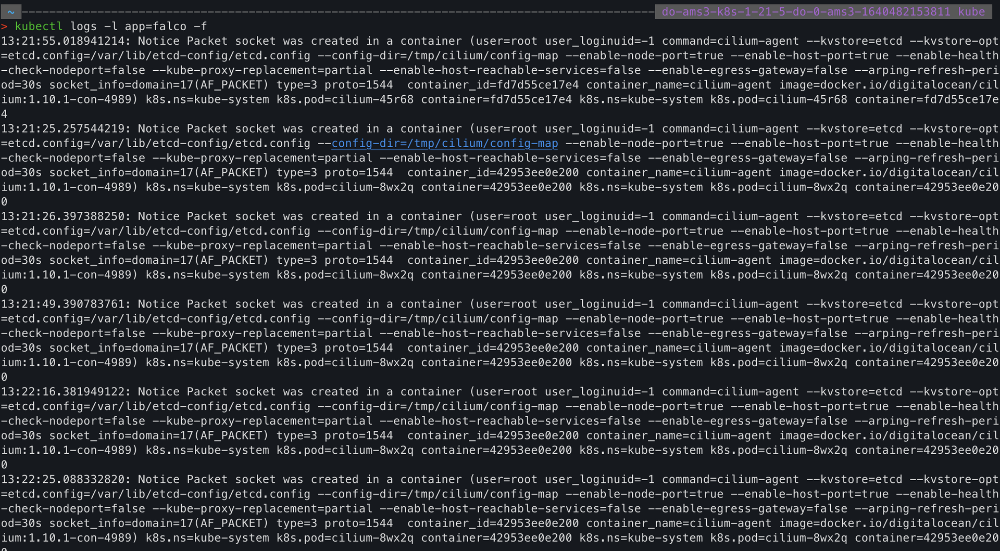
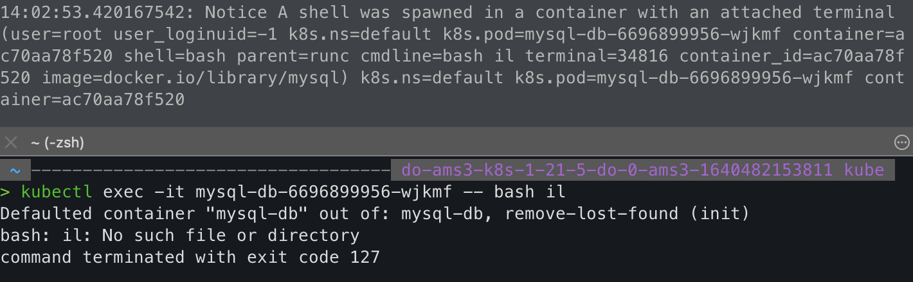
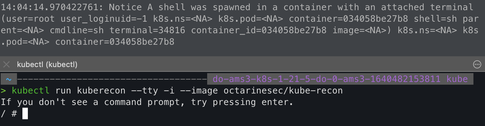
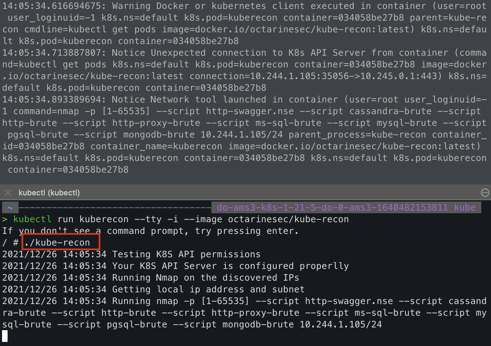

# Setup
## Create a managed k8s cluster
Go to Digital Ocean Menu and click Kubernetes



After that click create a K8s Cluster and fill the necessary information.



## Connect to the digital ocean k8s cluster

---

### Step 1: Install doctl
We will need Digital Ocean command-line interface (CLI) for the DigitalOcean API. So let's install it
````
brew install doctl
````

---

### Step 2: Create an API token

To generate a personal access token, log in to the DigitalOcean Control Panel.

Click the API link in the main navigation, which takes you to the Applications & API page on the Tokens/Keys tab. In the Personal access tokens section, click the Generate New Token button.

Copy the generated Token (and don't lose it until you have access to doctl).

---

### Step 3: Use the API token to grant account access to doctl

After that, Use the API token to grant doctl access to your DigitalOcean account. Pass in the token string when prompted by doctl auth init, and give this authentication context a name.

```
doctl auth init --context <NAME>
````



---

### Step 4: Connect to the cluster

Finally to connect to the cluster by running
```
doctl kubernetes cluster kubeconfig save <CLUSTER-ID|CLUSTER-NAME>
```

Having connected to the cluster, we can now run kubectl commands.

Here we can see the Worker nodes that are running in the cluster:


---
# K8s challenge

Now that we did the setup, we can finally start the challenge.

I've chosen to Deploy a security and compliance system to continuously monitor and detect threats, using [Falco](https://falco.org/docs/).

For this we will be installing Falco with Helm. So we need to install Helm

```
brew install helm
```

Before installing the chart, add the falcosecurity charts repository
```
helm repo add falcosecurity https://falcosecurity.github.io/charts
helm repo update
```

Install the Falco Chart

```
helm install falco falcosecurity/falco
```

The output should be something like


The installed Chart deployed falco as a DaemonSet, which means that it has a pod running on every node.

If we fetch DaemonSets with kubectl (using k as an alias of kubectl) we can see that there's 3 pods running, just as there is 3 Worker nodes seen previously.


Now let's check the logs to ensure that Falco is running, run

```
kubectl logs -l app=falco -f
```
The output should be similar to


---

# Testing

We will need an environment to emulate the attacks and detect them. Let us set it up. We will be using Helm for this.

```
helm repo add stable https://charts.helm.sh/stable
helm repo update
helm install mysql-db stable/mysql
```

On another terminal shell let's monitor Falco logs
```
kubectl logs -l app=falco -f
```

## Scenario 1: Terminal shell in container

Detecting terminal shells being spawned in pods. We open a terminal shell on a running pod to replicate the scenario.



On the image above, we can see the logs on the top part of the image that appear when a terminal shell was spawned in a pod, the command run is on the lowest part of the image.

---
## Scenario 2: Contact Kubernetes API Server From Container 

We run kube-recon, which is a tool which does initial reconnaissance in a Kubernetes environment. This rule detects attempts to contact the Kubernetes API Server from a container.





# Results:

In this challenge, we used Falco to allows us to use rules to achieve the detection of security issues. The default detection ruleset of Falco is enough to get yourself up and running, but you will probably want to build on top of the default ruleset and create new rules.
